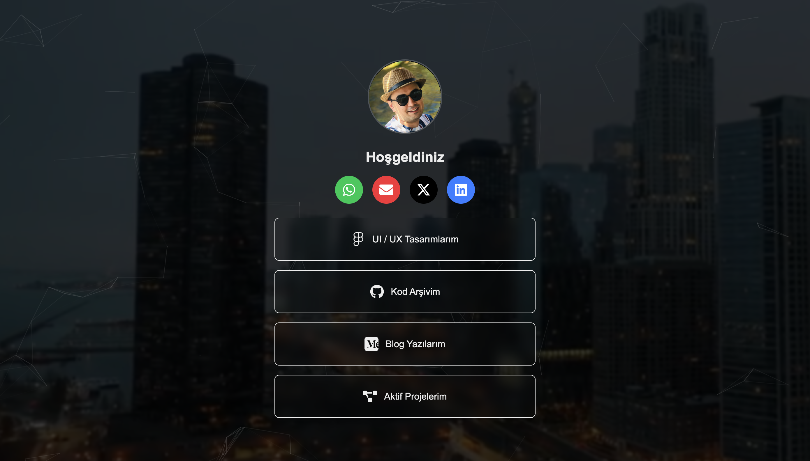

# Modern Portfolio & Project Showcase

A modern, responsive portfolio website built with Next.js 14, featuring a sleek design, project showcase, and interactive elements.

[](https://portfolio-demo.vercel.app)



## 🌟 Features

- **Modern Design**: Clean and professional UI with smooth animations
- **Project Showcase**: Beautiful cards to display your projects with live demos
- **Responsive**: Fully responsive design that works on all devices
- **Performance**: Optimized for speed and SEO
- **Interactive Elements**: Particle effects and dynamic backgrounds
- **Dark Mode**: Built-in dark theme for better viewing experience

## 🚀 Tech Stack

- **Framework**: Next.js 14
- **Styling**: TailwindCSS
- **Icons**: React Icons
- **Deployment**: Vercel
- **Analytics**: Firebase Analytics
- **Hosting**: Firebase Hosting

## 📦 Installation

1. Clone the repository:
```bash
git clone https://github.com/yourusername/nextjs-portfolio-template.git
cd nextjs-portfolio-template
```

2. Install dependencies:
```bash
npm install
```

3. Create a `.env.local` file in the root directory and add your Firebase configuration:
```env
NEXT_PUBLIC_FIREBASE_API_KEY=your_api_key
NEXT_PUBLIC_FIREBASE_AUTH_DOMAIN=your_auth_domain
NEXT_PUBLIC_FIREBASE_PROJECT_ID=your_project_id
NEXT_PUBLIC_FIREBASE_STORAGE_BUCKET=your_storage_bucket
NEXT_PUBLIC_FIREBASE_MESSAGING_SENDER_ID=your_messaging_sender_id
NEXT_PUBLIC_FIREBASE_APP_ID=your_app_id
NEXT_PUBLIC_FIREBASE_MEASUREMENT_ID=your_measurement_id
```

4. Run the development server:
```bash
npm run dev
```

5. Open [http://localhost:3000](http://localhost:3000) in your browser.

## 🛠️ Project Structure

```
├── public/
│   ├── images/      # Static images
│   └── videos/      # Background videos
├── src/
│   ├── app/         # Next.js app directory
│   │   ├── components/  # Reusable components
│   │   └── projects/    # Project showcase page
│   └── utils/       # Utility functions
└── ...
```

## 📝 Customization

### Adding New Projects

1. Open `src/app/projects/page.tsx`
2. Add a new project object to the `projects` array:
```typescript
{
  id: number,
  title: string,
  description: string,
  thumbnail: string,
  technologies: string[]
}
```

### Modifying Styles

- Global styles are in `src/app/globals.css`
- Component-specific styles use TailwindCSS classes
- Custom animations are defined in component files

## 🚀 Deployment

1. Build the project:
```bash
npm run build
```

2. Deploy to Vercel:
```bash
vercel
```

Or deploy to Firebase:
```bash
firebase deploy
```

## 📄 License

This project is open source and available under the [MIT License](LICENSE).

## 🤝 Contributing

Contributions, issues, and feature requests are welcome! Feel free to check the [issues page](https://github.com/yourusername/nextjs-portfolio-template/issues).

## 📧 Contact

For any questions or suggestions, please open an issue in the GitHub repository.
